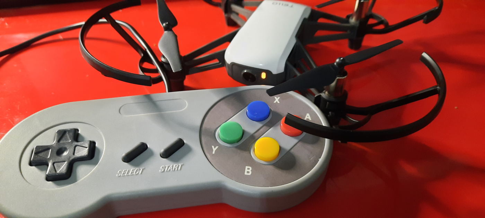

# snes-tello

control your [Ryze Tello](https://www.ryzerobotics.com/tello) drone with a Super Nintendo controller!

a quick weekend project :P

## usage

- get an esp32
- get platformio
- `pio run -t upload`
- go to the driver
- `cargo run -- --help`
- read it
- set the options and run

## thanks

- [Alexander89/rust-tello](https://github.com/Alexander89/rust-tello)
- `$FAMILY_MEMBER` who thought this was a good birthday gift

## license

MIT, see `LICENSE` file

